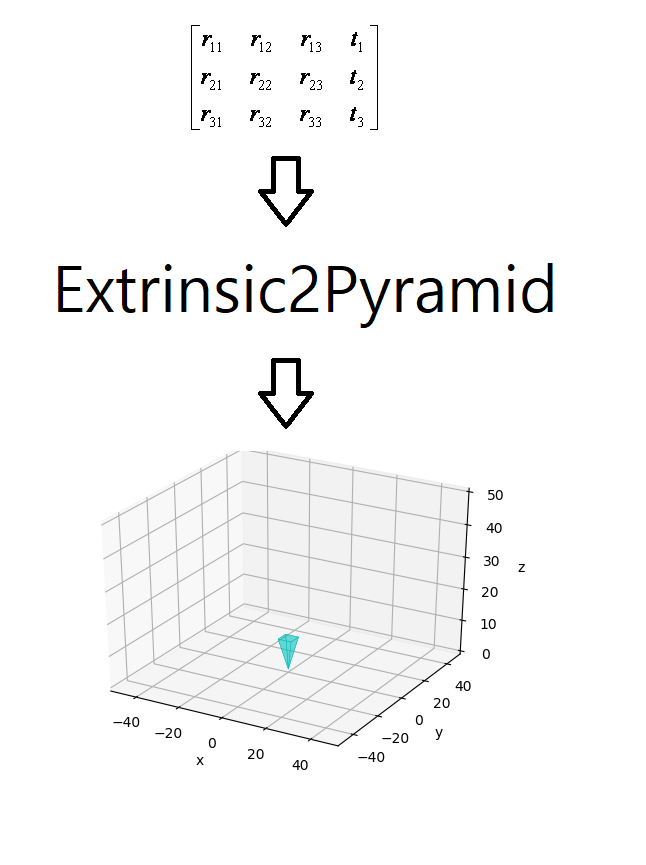
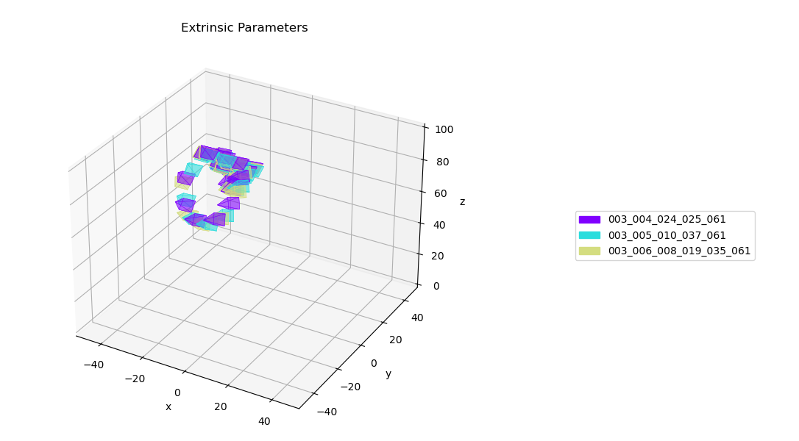
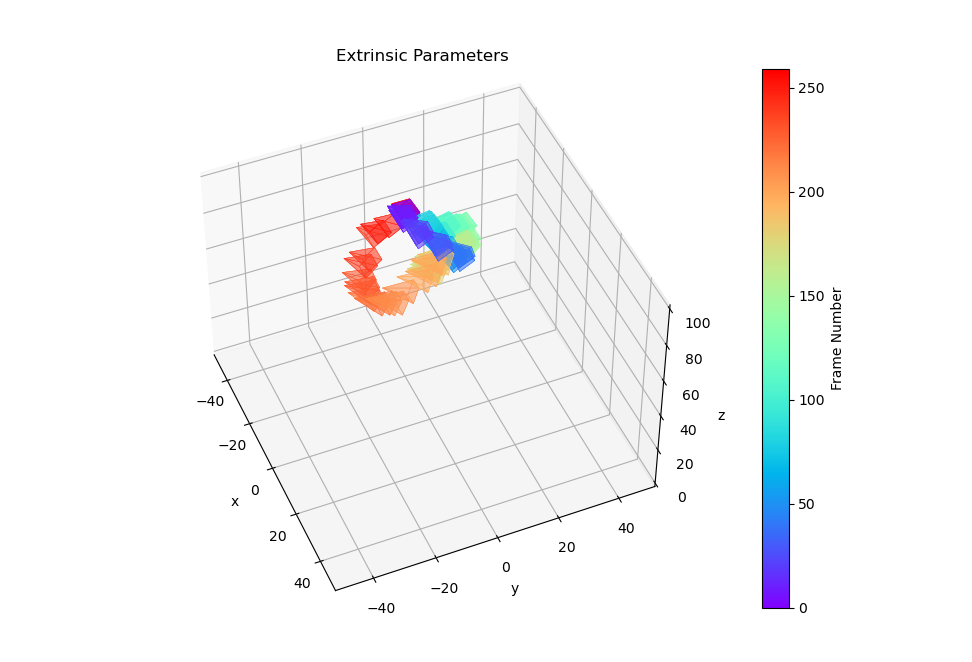

# extrinsic2pyramid
Visualize Camera's Pose Using Extrinsic Parameter by Plotting Pyramid Model on 3D Space



## Intro
A very simple and straightforward module for visualizing camera pose on 3D space.
This module just have a only utility, as like its name, to convert extrinsic camera parameter(transform matrix) to visual 3D square pyramid, the pyramid's vertex not on the base side(square) is the camera's focal point and The optical axis passes through the focal point and the center of the base.


Note that, this module do not contain any calibration algorithm. It's just for visualizing calibrated parameter.


## Requirements
numpy >= 1.2


numpy-quaternion


matplotlib


glob


## Trouble Shooting
### ImportError: numpy.core.multiarray failed to import
```c
conda install -c conda-forge quaternion
```


## Usage
To visualize extrinsic camera parameters, the **only module** you need to import is, **'CameraPoseVisualizer'** from 'util.camera_pose_visualizer'
```c
from util.camera_pose_visualizer import CameraPoseVisualizer
```


Initialize visualizer with 3 argument, the limit of visually plotted space.(the minimum/maximum value of x, y, z)
```c
visualizer = CameraPoseVisualizer([-50, 50], [-50, 50], [0, 100])
```


Conver extrinsic matrix with visualizer. it has 3 argument, extrinsic matrix, color of pyramid, scale of pyramid. The color of pyramid can be both represented as a character like 'r', 'c', 'k', and represented as RGBa sequence.
```c
visualizer.extrinsic2pyramid(np.eye(4), 'c', 10)
```


... That's all about this module. There are other python packages that can visualize camera pose on visual 3D space and even have more utilities, but, For who just want to visualize camera pose and do not want to spend time to learn NEW BIG multi-purpose 3D graphical library, for example, for SLAM Engineer who just want to qualitatively overview his localization result, or for 3D Machine Learning Engineer who just want to visually overview geometric constraint of new data before preprocess it, This Module can be a quite reasonable choice.


The core source-code of this module is just about-50-lines(not importing any other non-basic sub-module). About-50-line is all you need to grasp this module, that means, easy to be merged to your project, and easy to be a base-module for more complex architecture(see demo2.py).


## Dataset
The sample camera parameters in dataset directory is from YCB-M Dataset	[&#91;1&#93;](https://zenodo.org/record/2579173#.YK-mzaj7SUk).
The data hierarchy used in this dataset is one of a standard hierarchy that, in particular, almost of NVIDIA's open-sources support.
And this dataset share its hierarchy with other datasets like, YCB-VIDEO[&#91;2&#93;](https://rse-lab.cs.washington.edu/projects/posecnn/) and FAT[&#91;3&#93;](https://research.nvidia.com/publication/2018-06_Falling-Things).


## Demo
### demo1.py
In fact, just 11-lines of demo1.py is all about the usage of this module.


### demo2.py
This script is a example that manipulate this module for more complex architecture. Frankly, I made this module as a visualizing tool to visually analyze camera trajectory of YCB-M dataset before numerically preprocess it. I need indoor scenarios which have these constraints, 1.fixed multiple view cameras and we know its parameters. 2.cameras maintain same pose along all scenes. But there is a no dataset perfectly match with these. So, i have to search other scenarios. The alternative scenario i found is that, 1.static scene, 2.moving camera, 3.but along the scenes, there must be at least 4 point, which most of camera-trajectory from different scenes intersect(and camera-pose at that points are similar). Picking up intersecting points and Using them as like fixed multiple view cameras will quite work well for me. But before preprocess it in earnest. By watching trajectory scene-wisely and frame-wisely, I can make a rough estimate and a intuition about the posibility whether this dataset can pass the constraint-3.




The colors represent different scenes.





The distribution of color represents different frames.


## Roadmap
Utility that can toggle trajectory scene-wisely or frame-wisely.


GUI Interface.


## References
[1] T. Grenzdörffer, M. Günther, and J. Hertzberg, "YCB-M: A Multi-Camera RGB-D Dataset for Object Recognition and 6DoF Pose Estimation".


[2] Y. Xiang, T. Schmidt, V. Narayanan and D. Fox. "PoseCNN: A Convolutional Neural Network for 6D Object Pose Estimation in Cluttered Scenes".


[3] J. Tremblay, T. To, and S. Birchfield, Falling Things: "A Synthetic Dataset for 3D Object Detection and Pose Estimation".
